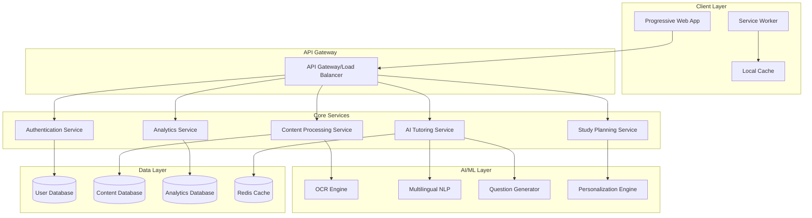

Note: This document focuses on clarity and feasibility for evaluation purposes. 
The system is designed as a conceptual, scalable AI platform.


# Design Document: StudyMate Bharat AI

## Overview

StudyMate Bharat AI is designed as a Progressive Web Application (PWA) that provides AI-powered educational assistance specifically tailored for Indian students. The system employs a microservices architecture with offline-first capabilities to ensure accessibility in low-bandwidth environments. The platform integrates advanced OCR for multilingual content processing, personalized AI tutoring, and adaptive learning algorithms to create a comprehensive educational ecosystem.

The design prioritizes cultural relevance, linguistic diversity, and technical accessibility while maintaining high educational standards. The system uses modern web technologies to deliver a native app-like experience that works seamlessly across devices and network conditions.

## Architecture

### High-Level Architecture



### Service Architecture Patterns

**Microservices Pattern**: Each core functionality is implemented as an independent service to enable scalability and maintainability.

**API Gateway Pattern**: Centralized entry point for all client requests, handling authentication, rate limiting, and request routing.

**Offline-First Pattern**: PWA with Service Worker caching ensures functionality during network interruptions.

**Event-Driven Architecture**: Services communicate through events for loose coupling and better scalability.

## Components and Interfaces

### 1. Progressive Web Application (PWA) Client

**Responsibilities:**
- Responsive user interface optimized for mobile and desktop
- Offline content caching and synchronization
- Real-time interaction with AI services
- Local storage management for user preferences

**Key Features:**
- Service Worker for offline functionality
- App Shell architecture for fast loading
- Push notifications for study reminders
- Installable on mobile devices

**Interface:**
```typescript
interface PWAClient {
  loadContent(contentId: string): Promise<Content>
  cacheForOffline(content: Content[]): Promise<void>
  syncWhenOnline(): Promise<void>
  displayNotification(message: string): void
}
```

### 2. Content Processing Service

**Responsibilities:**
- PDF text extraction and indexing
- OCR processing for handwritten notes and images
- Content structure preservation
- Multilingual text handling

**OCR Integration:**
- Supports Devanagari script (Hindi) and Latin script (English)
- Handles mixed-language documents
- Preserves formatting and structure
- Error correction for OCR output

**Interface:**
```typescript
interface ContentProcessor {
  extractTextFromPDF(file: File): Promise<ExtractedContent>
  processImageOCR(image: File, language: Language): Promise<OCRResult>
  indexContent(content: Content): Promise<ContentIndex>
  validateTextEncoding(text: string): Promise<ValidationResult>
}

interface ExtractedContent {
  text: string
  structure: DocumentStructure
  metadata: ContentMetadata
  language: Language
}
```

### 3. AI Tutoring Service

**Responsibilities:**
- Content simplification and explanation generation
- Context-aware responses
- Cultural adaptation of examples
- Multilingual content generation

**AI Model Integration:**
- Large Language Model for content generation
- Fine-tuned models for Indian educational context
- Multilingual capabilities (English/Hindi)
- Adaptive difficulty adjustment

**Interface:**
```typescript
interface AITutor {
  simplifyContent(content: string, level: AcademicLevel): Promise<SimplifiedContent>
  generateExplanation(topic: string, context: StudentContext): Promise<Explanation>
  translateContent(content: string, targetLanguage: Language): Promise<TranslatedContent>
  adaptToContext(content: string, culturalContext: CulturalContext): Promise<AdaptedContent>
}

interface StudentContext {
  academicLevel: AcademicLevel
  preferredLanguage: Language
  weakAreas: string[]
  learningStyle: LearningStyle
}
```

### 4. Study Planning Service

**Responsibilities:**
- Personalized study schedule generation
- Progress tracking and adaptation
- Weak area identification
- Goal setting and milestone tracking

**Planning Algorithm:**
- Spaced repetition for retention
- Adaptive scheduling based on performance
- Exam timeline optimization
- Load balancing across subjects

**Interface:**
```typescript
interface StudyPlanner {
  createStudyPlan(profile: StudentProfile, timeline: ExamTimeline): Promise<StudyPlan>
  updatePlanBasedOnProgress(planId: string, progress: StudyProgress): Promise<StudyPlan>
  identifyWeakAreas(performance: PerformanceData[]): Promise<WeakArea[]>
  generateDailyGoals(planId: string, date: Date): Promise<DailyGoal[]>
}

interface StudyPlan {
  id: string
  studentId: string
  subjects: Subject[]
  schedule: ScheduleItem[]
  milestones: Milestone[]
  adaptiveSettings: AdaptiveSettings
}
```

### 5. Question Generation Service

**Responsibilities:**
- Practice question creation from content
- Quiz generation with multiple formats
- Difficulty adaptation
- Performance-based question selection

**Question Types:**
- Multiple Choice Questions (MCQ)
- Short Answer Questions
- Descriptive Questions
- Code-based Questions (for technical subjects)

**Interface:**
```typescript
interface QuestionGenerator {
  generateQuestions(content: Content, questionType: QuestionType, count: number): Promise<Question[]>
  createQuiz(topics: string[], difficulty: Difficulty, duration: number): Promise<Quiz>
  adaptDifficulty(performance: QuestionPerformance[]): Promise<DifficultyLevel>
  generateSolutions(question: Question): Promise<Solution>
}

interface Question {
  id: string
  type: QuestionType
  content: string
  options?: string[]
  correctAnswer: string
  explanation: string
  difficulty: Difficulty
  topics: string[]
}
```

### 6. Analytics and Progress Tracking Service

**Responsibilities:**
- Performance data collection and analysis
- Learning pattern identification
- Progress visualization
- Recommendation generation

**Analytics Features:**
- Real-time performance tracking
- Learning curve analysis
- Comparative performance metrics
- Predictive analytics for exam readiness

**Interface:**
```typescript
interface AnalyticsService {
  trackStudySession(session: StudySession): Promise<void>
  analyzePerformance(studentId: string, timeframe: TimeFrame): Promise<PerformanceAnalysis>
  generateInsights(studentId: string): Promise<LearningInsight[]>
  predictExamReadiness(studentId: string, examDate: Date): Promise<ReadinessScore>
}

interface PerformanceAnalysis {
  overallScore: number
  subjectBreakdown: SubjectPerformance[]
  improvementAreas: string[]
  strengths: string[]
  recommendations: Recommendation[]
}
```

## Data Models

### Core Data Structures

```typescript
// User and Profile Models
interface Student {
  id: string
  email: string
  name: string
  preferredLanguage: Language
  academicLevel: AcademicLevel
  educationBoard: EducationBoard
  profile: StudentProfile
  createdAt: Date
  lastActive: Date
}

interface StudentProfile {
  subjects: Subject[]
  examTimeline: ExamTimeline
  learningPreferences: LearningPreferences
  performanceHistory: PerformanceRecord[]
  weakAreas: WeakArea[]
  goals: AcademicGoal[]
}

// Content Models
interface Content {
  id: string
  title: string
  type: ContentType
  subject: string
  language: Language
  difficulty: Difficulty
  extractedText: string
  structure: DocumentStructure
  metadata: ContentMetadata
  uploadedBy: string
  createdAt: Date
}

interface DocumentStructure {
  chapters: Chapter[]
  sections: Section[]
  topics: Topic[]
  keywords: string[]
  concepts: Concept[]
}

// Learning Models
interface StudySession {
  id: string
  studentId: string
  contentId: string
  startTime: Date
  endTime: Date
  activitiesCompleted: Activity[]
  questionsAnswered: QuestionAttempt[]
  performanceScore: number
  timeSpent: number
}

interface QuestionAttempt {
  questionId: string
  studentAnswer: string
  correctAnswer: string
  isCorrect: boolean
  timeSpent: number
  hintsUsed: number
  difficulty: Difficulty
}

// Planning Models
interface ExamTimeline {
  examDate: Date
  preparationStartDate: Date
  subjects: ExamSubject[]
  totalStudyHours: number
  weeklyHours: number
}

interface ScheduleItem {
  id: string
  date: Date
  startTime: string
  endTime: string
  subject: string
  topics: string[]
  activityType: ActivityType
  priority: Priority
  completed: boolean
}
```

### Database Schema Design

**User Database (PostgreSQL)**
- Stores user profiles, preferences, and authentication data
- Optimized for quick user lookup and profile updates
- Includes indexes on frequently queried fields

**Content Database (MongoDB)**
- Stores processed educational content and metadata
- Document-based structure for flexible content types
- Full-text search capabilities for content discovery

**Analytics Database (ClickHouse)**
- Time-series data for performance tracking
- Optimized for analytical queries and reporting
- Real-time aggregation capabilities

**Cache Layer (Redis)**
- Session management and temporary data storage
- Frequently accessed content caching
- Real-time data for active learning sessions

## Correctness Properties

*A property is a characteristic or behavior that should hold true across all valid executions of a system—essentially, a formal statement about what the system should do. Properties serve as the bridge between human-readable specifications and machine-verifiable correctness guarantees.*

### Property Reflection

After analyzing all acceptance criteria, I identified several areas where properties can be consolidated to eliminate redundancy:

- Language consistency properties (3.1, 3.2) can be combined into a single multilingual consistency property
- Content processing properties (1.1, 1.2, 1.4) share common validation patterns and can be streamlined
- Performance tracking properties (8.1, 8.5) both deal with data persistence and can be unified
- Accessibility properties (9.1, 9.2) can be combined into a comprehensive accessibility property

### Core Correctness Properties

**Property 1: Content Processing Round-Trip Integrity**
*For any* uploaded content (PDF, image, or manual input), processing then retrieving the content should preserve all essential information and structure while maintaining proper text encoding for multilingual content.
**Validates: Requirements 1.1, 1.2, 1.3, 1.4, 1.5**

**Property 2: AI Explanation Consistency**
*For any* complex concept and student academic level, the AI tutor should provide simplified explanations that maintain accuracy, include relevant Indian cultural context, and provide definitions for technical terminology.
**Validates: Requirements 2.1, 2.2, 2.3, 2.5**

**Property 3: Adaptive Explanation Generation**
*For any* student confusion indicator, the AI tutor should provide alternative explanations using different approaches while maintaining content accuracy.
**Validates: Requirements 2.4**

**Property 4: Multilingual Consistency**
*For any* student language preference (English or Hindi), all system outputs including explanations, questions, and interface elements should consistently use the selected language while maintaining technical accuracy in translations.
**Validates: Requirements 3.1, 3.2, 3.4, 3.5**

**Property 5: Mixed Language Preservation**
*For any* content containing mixed English and Hindi text, the system should preserve the original language structure while providing translations only when explicitly needed.
**Validates: Requirements 3.3**

**Property 6: Study Plan Completeness**
*For any* exam timeline and syllabus, the generated study plan should cover all required topics before the exam date with appropriate time allocation.
**Validates: Requirements 4.1, 4.5**

**Property 7: Adaptive Study Planning**
*For any* identified weak areas or schedule delays, the study planner should automatically adjust time allocation and rebalance the remaining study plan to maintain exam readiness.
**Validates: Requirements 4.2, 4.3, 4.4**

**Property 8: Question Generation Completeness**
*For any* studied topic, the question generator should create practice questions that include appropriate question types (MCQ, short answer, descriptive) and provide step-by-step solutions for problem-solving content.
**Validates: Requirements 5.1, 5.2, 5.4**

**Property 9: Adaptive Question Difficulty**
*For any* student performance level, the question generator should track difficulty and adapt question selection to create additional practice for poorly performing areas.
**Validates: Requirements 5.3, 5.5**

**Property 10: Bandwidth Optimization**
*For any* network condition, the system should optimize content delivery by compressing content without losing educational value, caching essential content for offline access, and prioritizing text-based responses in low-bandwidth scenarios.
**Validates: Requirements 6.1, 6.2, 6.4**

**Property 11: Connectivity Adaptation**
*For any* improvement in network connectivity, the system should preload content and provide a lightweight interface that loads quickly across all connection speeds.
**Validates: Requirements 6.3, 6.5**

**Property 12: Code Analysis Accuracy**
*For any* submitted code with errors, the developer assistant should identify all errors and provide corrective suggestions with relevant examples and explanations.
**Validates: Requirements 7.1, 7.3**

**Property 13: Algorithm Explanation Completeness**
*For any* algorithm or technical concept, the developer assistant should provide step-by-step breakdowns with visual representations and relate concepts to practical applications and real-world scenarios.
**Validates: Requirements 7.2, 7.4**

**Property 14: Programming Language Support**
*For any* programming language commonly taught in Indian educational institutions, the developer assistant should provide consistent support and functionality.
**Validates: Requirements 7.5**

**Property 15: Performance Data Persistence**
*For any* completed study session, quiz, or practice activity, the system should record comprehensive performance metrics, update student profiles, and maintain long-term learning history.
**Validates: Requirements 8.1, 8.5**

**Property 16: Learning Analytics Intelligence**
*For any* student performance data, the system should identify learning patterns, highlight areas needing attention, and adjust study plans when performance improves in previously weak areas.
**Validates: Requirements 8.2, 8.3**

**Property 17: Actionable Progress Insights**
*For any* progress report generation, the system should provide actionable insights and specific recommendations based on the student's learning data.
**Validates: Requirements 8.4**

**Property 18: Universal Accessibility**
*For any* student with accessibility needs (visual impairments, different learning speeds), the system should provide appropriate accommodations including screen reader compatibility, high contrast options, and customizable pacing.
**Validates: Requirements 9.1, 9.2**

**Property 19: Curriculum Adaptability**
*For any* educational board or economic background, the system should adapt content to match specific curriculum requirements and provide core functionality without premium subscription barriers.
**Validates: Requirements 9.3, 9.4**

**Property 20: Cultural Sensitivity**
*For any* generated content and examples, the system should ensure cultural sensitivity and appropriateness for the Indian educational context.
**Validates: Requirements 9.5**

**Property 21: Data Privacy Compliance**
*For any* student data operation (collection, storage, sharing, deletion), the system should follow data minimization principles, apply encryption, ensure complete deletion when requested, and anonymize data for system improvement purposes.
**Validates: Requirements 10.1, 10.2, 10.3, 10.4**

<function_calls>
<invoke name="prework">
<parameter name="featureName">studymate-bharat-ai

## Error Handling

### Error Categories and Strategies

**1. Content Processing Errors**
- **OCR Failures**: Implement fallback mechanisms for poor image quality, provide manual correction options
- **PDF Corruption**: Validate file integrity before processing, provide clear error messages for unsupported formats
- **Encoding Issues**: Detect and handle character encoding problems, especially for Devanagari script
- **Large File Handling**: Implement chunked processing for large documents, provide progress indicators

**2. AI Service Errors**
- **Model Unavailability**: Implement circuit breaker pattern, fallback to cached responses when possible
- **Content Generation Failures**: Retry with simplified prompts, provide generic explanations as fallback
- **Translation Errors**: Validate translation quality, allow manual correction, maintain original text as backup
- **Context Loss**: Implement conversation state management, recover from partial context loss

**3. Network and Connectivity Errors**
- **Offline Mode**: Graceful degradation to cached content, queue operations for later synchronization
- **Slow Connections**: Progressive loading, content prioritization, compression optimization
- **Intermittent Connectivity**: Automatic retry with exponential backoff, local state persistence
- **Bandwidth Limitations**: Adaptive content delivery, text-first approach, optional media loading

**4. Data Integrity Errors**
- **Corrupted User Data**: Regular data validation, backup and recovery mechanisms
- **Synchronization Conflicts**: Conflict resolution strategies, user notification for manual resolution
- **Performance Data Loss**: Redundant storage, graceful handling of missing metrics
- **Privacy Violations**: Data access auditing, automatic anonymization verification

### Error Recovery Mechanisms

```typescript
interface ErrorHandler {
  handleContentError(error: ContentError): Promise<ErrorRecovery>
  handleAIServiceError(error: AIServiceError): Promise<ErrorRecovery>
  handleNetworkError(error: NetworkError): Promise<ErrorRecovery>
  handleDataError(error: DataError): Promise<ErrorRecovery>
}

interface ErrorRecovery {
  strategy: RecoveryStrategy
  fallbackContent?: Content
  userMessage: string
  retryable: boolean
  reportToAnalytics: boolean
}
```

## Testing Strategy

### Dual Testing Approach

The testing strategy employs both unit testing and property-based testing to ensure comprehensive coverage:

**Unit Tests**: Focus on specific examples, edge cases, and integration points
- Content processing with various file formats and languages
- AI response validation for specific scenarios
- User interface interactions and accessibility features
- Error handling for known failure modes

**Property-Based Tests**: Verify universal properties across all inputs
- Content processing integrity across random inputs
- AI explanation consistency across various topics and levels
- Multilingual functionality across language combinations
- Performance optimization across network conditions

### Property-Based Testing Configuration

**Testing Framework**: Use Hypothesis (Python) or fast-check (TypeScript) for property-based testing
**Test Configuration**: Minimum 100 iterations per property test to ensure comprehensive input coverage
**Test Tagging**: Each property test must reference its corresponding design document property

Example test tags:
- **Feature: studymate-bharat-ai, Property 1: Content Processing Round-Trip Integrity**
- **Feature: studymate-bharat-ai, Property 4: Multilingual Consistency**
- **Feature: studymate-bharat-ai, Property 10: Bandwidth Optimization**

### Testing Priorities

**High Priority**:
1. Content processing and OCR accuracy (Properties 1, 5)
2. AI explanation quality and cultural relevance (Properties 2, 3, 20)
3. Multilingual functionality (Properties 4, 5)
4. Data privacy and security (Property 21)

**Medium Priority**:
1. Study planning and adaptation (Properties 6, 7)
2. Question generation and difficulty adaptation (Properties 8, 9)
3. Performance tracking and analytics (Properties 15, 16, 17)

**Lower Priority**:
1. Bandwidth optimization (Properties 10, 11)
2. Developer assistance features (Properties 12, 13, 14)
3. Accessibility features (Properties 18, 19)

### Integration Testing

**End-to-End Scenarios**:
- Complete student journey from registration to exam preparation
- Cross-service communication and data consistency
- Offline-to-online synchronization
- Multi-device usage patterns

**Performance Testing**:
- Load testing with concurrent users
- Bandwidth simulation for rural connectivity
- Mobile device performance optimization
- Database query optimization under load

### Cultural and Linguistic Testing

**Specialized Testing Requirements**:
- Hindi/Devanagari text processing accuracy
- Cultural sensitivity validation for generated content
- Regional curriculum alignment testing
- Accessibility compliance for Indian standards

This comprehensive testing strategy ensures that StudyMate Bharat AI meets the high standards required for educational software while addressing the unique challenges of the Indian market.